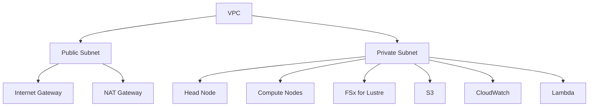

# AWS HPC Drug Discovery Platform

Welcome to the AWS HPC Drug Discovery Platform documentation. This platform provides a high-performance computing infrastructure for drug discovery research, leveraging AWS ParallelCluster, FSx for Lustre, and other AWS services.

## Overview

The platform consists of several key components:

- **HPC Cluster**: AWS ParallelCluster with head and compute nodes
- **High-Performance Storage**: FSx for Lustre filesystem
- **Data Lake**: S3 bucket with lifecycle policies
- **Monitoring**: CloudWatch metrics and alarms
- **Cost Optimization**: Auto-shutdown Lambda function

## Quick Start

1. [Set up your development environment](development/setup.md)
2. [Deploy the infrastructure](infrastructure/deployment.md)
3. [Configure monitoring](infrastructure/monitoring.md)
4. [Start using the platform](development/setup.md#usage)

## Features

- **Scalable Compute**: Auto-scaling HPC cluster
- **High-Performance Storage**: FSx for Lustre integration
- **Cost Optimization**: Automatic shutdown of idle resources
- **Security**: VPC isolation and IAM roles
- **Monitoring**: Real-time metrics and alerts
- **Disaster Recovery**: Backup and recovery procedures

## Architecture

## Cost Estimation

The platform costs vary based on usage:

- **Development**: ~$500/month
- **Production**: ~$5,000/month
- **Burst**: Up to $50,000/month

See [Cost Estimation](infrastructure/cost_estimation.md) for details.

## Security

The platform implements several security measures:

- VPC isolation
- IAM roles and policies
- Security groups
- Network ACLs
- Encryption at rest and in transit

See [Security](infrastructure/security.md) for details.

## Contributing

1. Fork the repository
2. Create a feature branch
3. Make your changes
4. Run tests
5. Submit a pull request

See [Development](development/setup.md) for details.

## License

This project is licensed under the MIT License - see the [LICENSE](LICENSE) file for details. 